# React Component Library with Storybook

This repository is an implementation of a test task to create a small library of React components. The project uses TypeScript, Vite, and Storybook to develop, visualize, and test components in an isolated environment.

## Project goal

### Create a Storybook-based UI component system that includes:

- Smart Input component (multi-type, with password visibility toggle and clear option).

- Toast notification component (animated, with auto-close).

- Nested Sidebar Menu with slide-out animation.

### Technology stack

- React
- Vite
- TypeScript
- Framer Motion
- React Hook Form
- ESLint & Prettier

## Getting started

1. Clone repository
```  bash
git clone https://github.com/allmok/test_task_-DevelopsToday
```  
2. Install dependencies:
```  bash
npm install
```  
3. run Storybook
```  bash
npm run storybook
```  
4. Open http://localhost:6006 in your browser.

--- 

## Components
### 1. Input Component

- A multifunctional component for data entry.

- Password visibility toggle: If type="password", an icon appears to show/hide the password.

- Clear field: If clearable=true, an "X" button appears to quickly clear the entered value.

- Type support: Works with text, password, number and other standard types.

### Screenshots

| 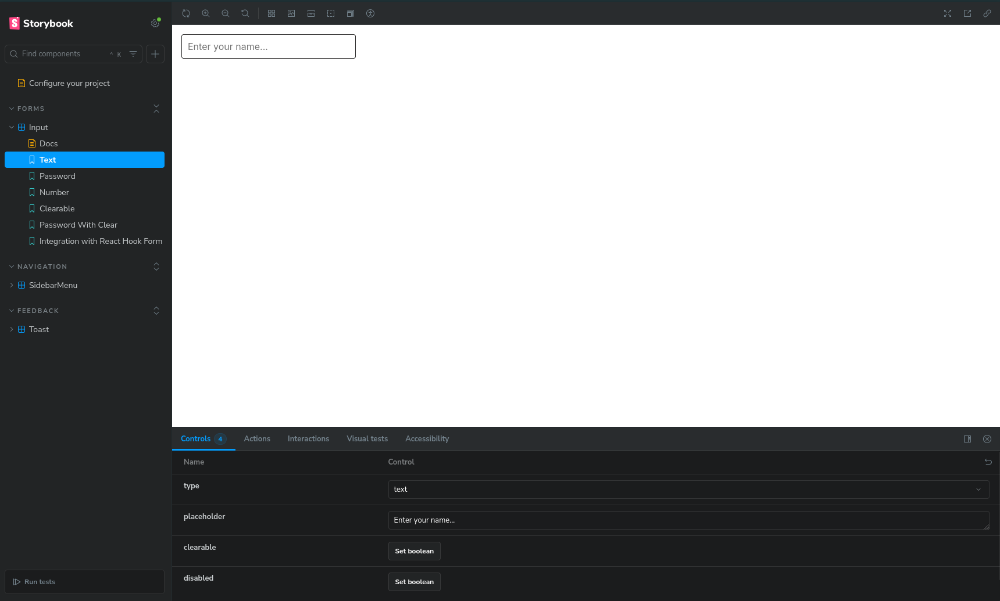|            |
| -------------------------------------------------- | -------------------------------------------------- |
|  | 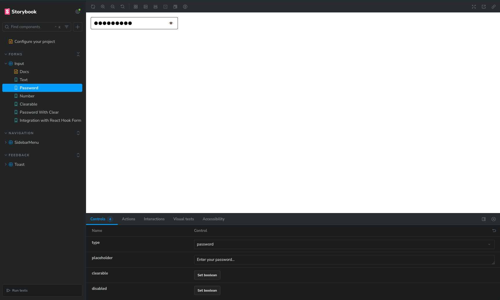 |
| 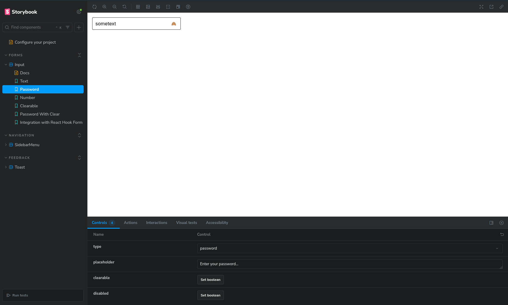|            |
| -------------------------------------------------- | -------------------------------------------------- |
| 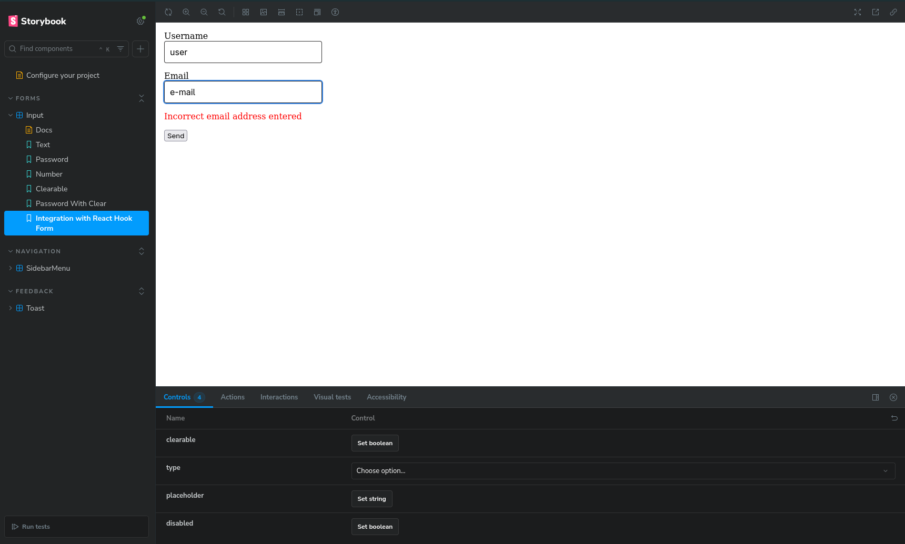 | 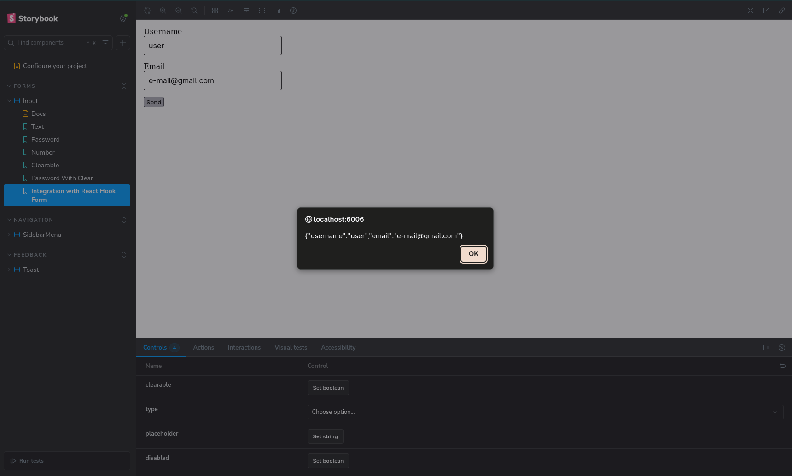 |
| 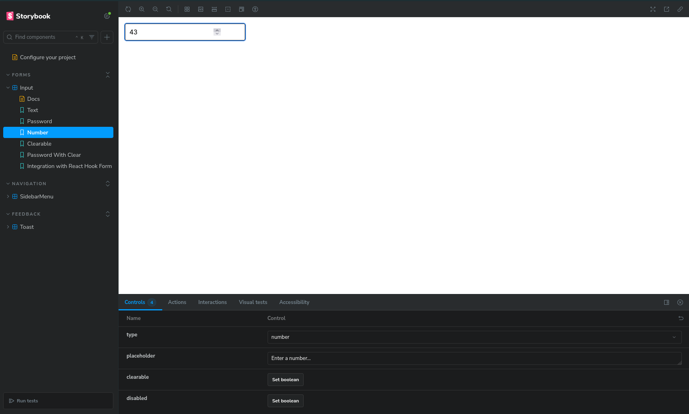 |  |

### 2. Toast Component

- Notification system with imperative API for displaying temporary messages.

- Positioning: Appears in the lower right corner of the screen.

- Auto-close: Automatically disappears after a specified period of time.

- Animation: Smooth appearance and disappearance using Framer Motion.

- Types: Supports different states (success, error, info).


### Screenshots

| 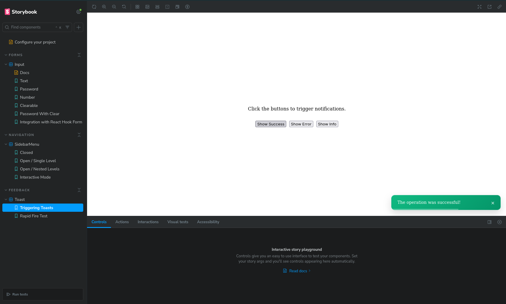| 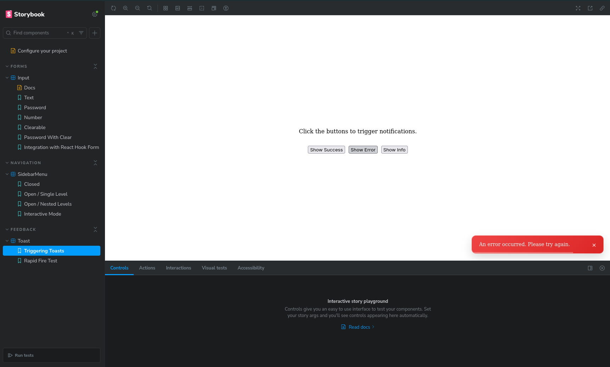           |
| -------------------------------------------------- | -------------------------------------------------- |
| 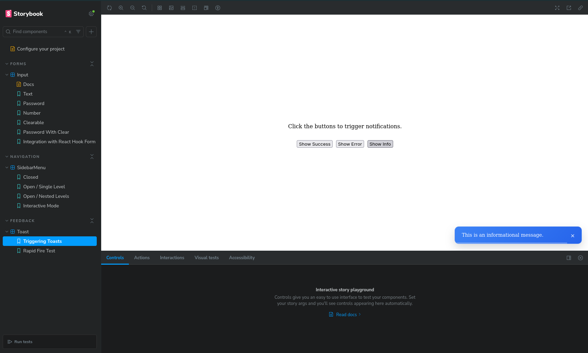 | 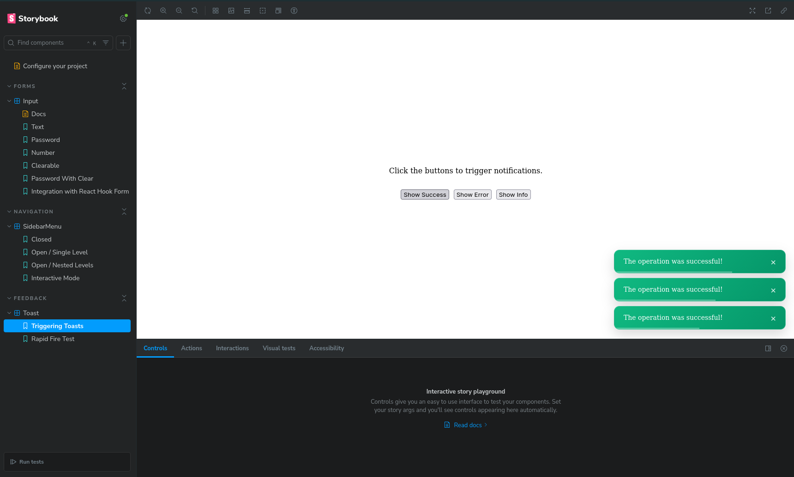 |
| 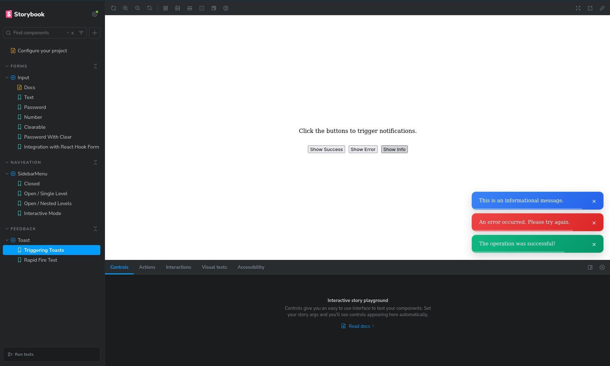| 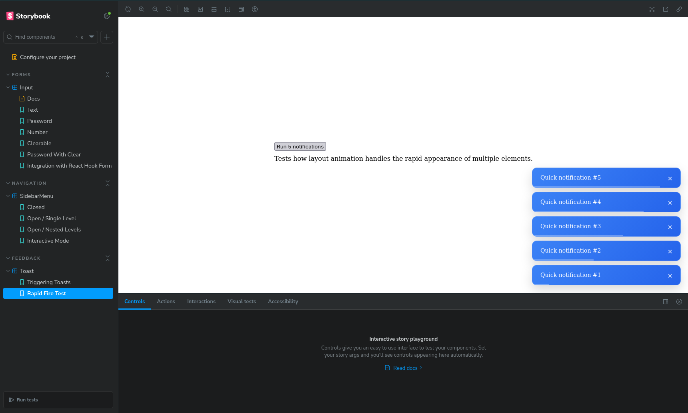     |


### 3. Sidebar Menu Component

- Sidebar navigation menu.

- Animation: Smoothly slides out from the right.

- Nesting: Supports unlimited levels of menu nesting (accordion).

- Closing: Closes when you click on the background or the close button.

### Screenshots

| 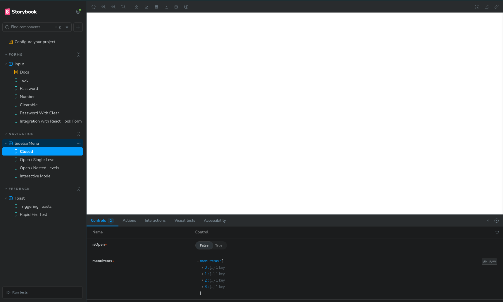| 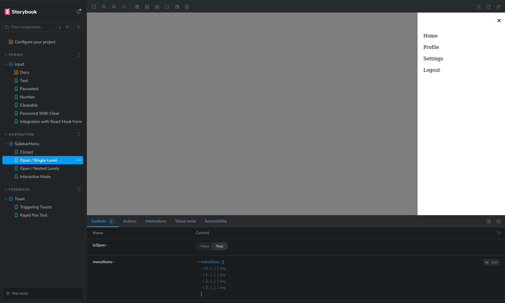           |
| -------------------------------------------------- | -------------------------------------------------- |
| 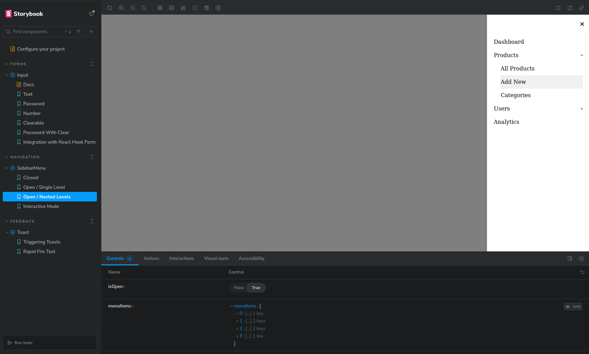 | 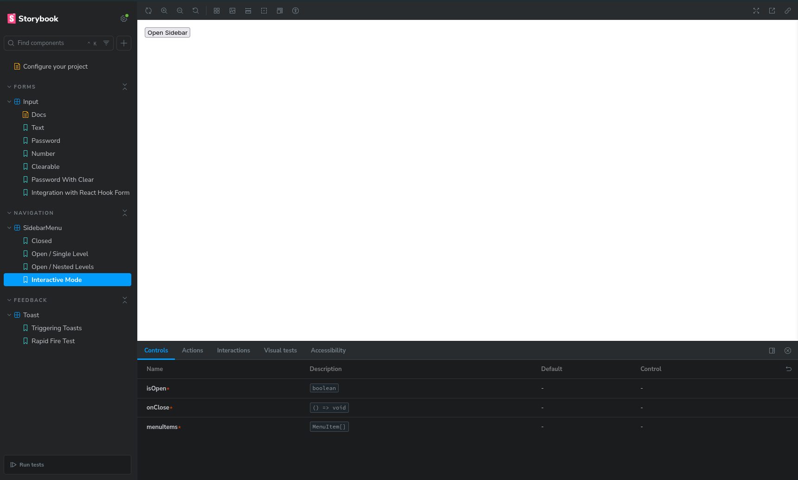 |
| 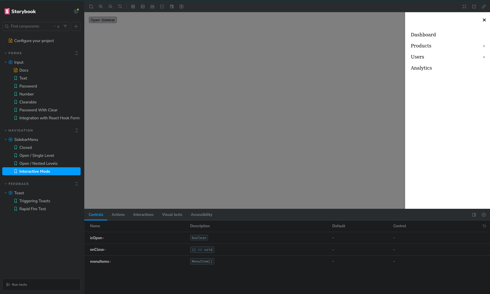|